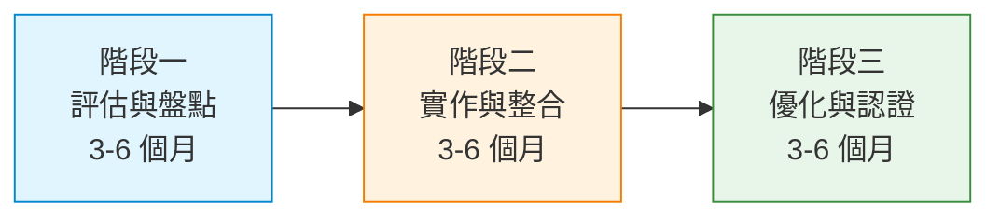

# AI Implementation Guide — 2026-03 {: .no_toc }

<div class="key-takeaway">
本月重點：使用 CSA MAESTRO 框架對 Agentic AI 系統進行七層威脅建模與 CI/CD 整合、建立 AI Agent 專用的 Policy-as-Code 自動化授權架構、以及在雲原生環境採用階段性方法落地 AI 治理框架（ISO 42001 + NIST AI RMF）。
</div>

> 本期聚焦 10 項 AI 治理要求的技術實作，涵蓋 NIST AI RMF、CSA MAESTRO 框架、ISO 42001 等權威指引。

## 免責聲明

本指引由 AI 系統自動產出，基於公開框架與標準萃取技術實作建議。
內容僅供參考，實際實作需考慮組織特定情境與技術架構。
建議在正式採用前由工程團隊與領域專家審閱。

---

<div class="report-meta">

## 報告資訊 {: .no_toc }

| 項目 | 內容 |
|------|------|
| 產出方式 | AI 自動產出（Claude Opus 4） |
| 審核狀態 | <span class="badge-reviewed">已通過自動審核</span> |
| 審核依據 | CLAUDE.md 自我審核 Checklist |
| 資料來源 | 30 個權威來源（NIST、CSA、EU、SANS 等） |
| 資料時間 | 2024-05-02 ~ 2026-02-26 |

</div>

---



---

## 本月實作清單

<p class="key-answer" data-question="本月有哪些 AI 實作要點">
  <strong>Agentic AI 威脅建模與 AI Agent 自動化授權</strong>是本月最優先的實作項目。隨著 AI Agent 在企業環境大量部署，CSA MAESTRO 框架提供了七層威脅建模方法論，而 AI Agent 的 IAM 架構必須從傳統人類同意式授權轉向 Policy-as-Code 自動化執行。
</p>

### 必做項目

- [ ] **導入 MAESTRO 框架進行 Agentic AI 威脅建模**
  - 來源：CSA MAESTRO Framework
  - 優先級：高
  - 說明：對組織內所有 Agentic AI 系統依 MAESTRO 七層模型進行威脅評估，識別各層攻擊面並建立緩解措施

- [ ] **建立 AI Agent 專用 IAM 授權架構**
  - 來源：CSA AI Security Series — IAM at Agent Velocity
  - 優先級：高
  - 說明：將 AI Agent 的授權機制從人類同意式改為 Policy-as-Code 自動化執行，支援每分鐘數千次操作的速度需求

- [ ] **實施 AI 系統 Credential Lifecycle 管理**
  - 來源：CSA AI Security Series — Credential Lifecycle
  - 優先級：高
  - 說明：建立 AI 系統憑證的自動輪換、範圍限縮與過期撤銷機制，防止「授權超越意圖」風險

- [ ] **盤點組織內 Shadow AI 與嵌入式 AI 風險**
  - 來源：CSA — What AI Risks Are Hiding in Your Apps
  - 優先級：高
  - 說明：識別 SaaS 應用中嵌入的 AI 功能，評估資料外洩、模型偏差與合規風險

### 建議項目

- [ ] **建立 AI 不確定性量化機制**
  - 來源：CSA — What if AI Knew When to Say "I Don't Know"
  - 優先級：中
  - 說明：導入 Conformal Prediction 或 Bayesian 方法，讓 AI 系統能量化並表達預測不確定性

- [ ] **實作雲原生 AI 治理框架階段性部署**
  - 來源：CSA — AI Governance Framework Adoption in Cloud-Native AI Systems
  - 優先級：中
  - 說明：依據三階段方法（評估、實作、優化）在雲原生環境落地 ISO 42001 + NIST AI RMF

- [ ] **導入 Non-Human Identity (NHI) 管理機制**
  - 來源：CSA/Oasis Security — NHI Survey Report
  - 優先級：中
  - 說明：建立 AI Agent、API Token、Service Account 等非人類身份的統一管理與監控平台

- [ ] **建立 AI 信任證明（Proof of AI Trust）機制**
  - 來源：CSA — From Security to Proof of AI Trust
  - 優先級：中
  - 說明：從「假設 AI 安全」轉向「證明 AI 可信」，建立可驗證的信任鏈機制

- [ ] **部署 AI 威脅持續監控流程**
  - 來源：SANS ISC — OpenClaw 偵測與監控
  - 優先級：中
  - 說明：建立 AI 特有的威脅偵測規則（如暴露的 AI 模型 API、Agentic AI 爬蟲），整合至 SIEM/SOAR

- [ ] **導入 Privacy-Preserving Federated Learning 保護機制**
  - 來源：NIST — Protecting Model Updates in Privacy-Preserving Federated Learning
  - 優先級：中
  - 說明：在聯邦式學習場景中實作模型更新的隱私保護技術，防止模型逆推攻擊

---

## 框架映射表

<p class="key-answer" data-question="AI 治理框架之間如何對應">
  <strong>NIST AI RMF、CSF 2.0 與 ISO 42001 三大框架在風險評估、模型治理、測試驗證等領域有明確對應關係</strong>，組織可透過以下映射表同時滿足多框架合規要求。
</p>

<table class="comparison-table">
  <thead>
    <tr>
      <th>實作領域</th>
      <th>NIST AI RMF</th>
      <th>NIST CSF 2.0</th>
      <th>ISO 42001</th>
      <th>本月對應實作</th>
    </tr>
  </thead>
  <tbody>
    <tr>
      <td>風險評估</td>
      <td>MAP 1.1, MAP 1.5</td>
      <td>ID.RA-01, ID.RA-02</td>
      <td>6.1</td>
      <td>MAESTRO 七層威脅建模</td>
    </tr>
    <tr>
      <td>模型治理</td>
      <td>GOVERN 1.1, GOVERN 1.2</td>
      <td>GV.OC-01, GV.OC-02</td>
      <td>5.1, 5.2</td>
      <td>AI 治理框架階段性部署</td>
    </tr>
    <tr>
      <td>測試驗證</td>
      <td>MEASURE 2.5, MEASURE 2.6</td>
      <td>DE.CM-01, DE.CM-06</td>
      <td>9.1</td>
      <td>AI 不確定性量化</td>
    </tr>
    <tr>
      <td>存取控制</td>
      <td>GOVERN 6.1</td>
      <td>PR.AA-01, PR.AA-02</td>
      <td>A.8</td>
      <td>AI Agent IAM 自動化授權</td>
    </tr>
    <tr>
      <td>供應鏈安全</td>
      <td>MAP 3.4</td>
      <td>ID.SC-01</td>
      <td>A.10</td>
      <td>Shadow AI 盤點、NHI 管理</td>
    </tr>
    <tr>
      <td>持續監控</td>
      <td>MEASURE 3.2</td>
      <td>DE.AE-02, DE.AE-03</td>
      <td>9.3</td>
      <td>AI 威脅持續監控</td>
    </tr>
    <tr>
      <td>隱私保護</td>
      <td>MAP 2.3</td>
      <td>PR.DS-01</td>
      <td>A.7</td>
      <td>Federated Learning 隱私保護</td>
    </tr>
  </tbody>
</table>

---

## 技術實作細節

### Agentic AI 威脅建模：MAESTRO 框架導入

<p class="key-answer" data-question="如何對 Agentic AI 系統進行威脅建模">
  <strong>CSA MAESTRO 框架提供七層結構化威脅建模方法</strong>，可整合至 CI/CD 流程中自動化執行，涵蓋從基礎模型到部署監控的完整攻擊面。
</p>

**背景**：傳統威脅建模工具（SAST、STRIDE）無法覆蓋 Agentic AI 的多層架構風險。CSA 於 2026 年 2 月發布的 MAESTRO 框架針對 AI Agent 的七個層次定義了專屬威脅向量，並提供了將威脅建模整合至 CI/CD Pipeline 的實作指引。

**MAESTRO 七層威脅模型**：

| 層次 | 名稱 | 主要威脅 | 緩解措施 |
|------|------|----------|----------|
| L1 | Foundation Model | Prompt injection、模型竄改 | Input validation、模型簽章驗證 |
| L2 | Data & Context | 資料投毒、上下文操控 | 資料完整性檢查、存取控制 |
| L3 | Tool Integration | API 濫用、工具鏈攻擊 | 最小權限、API Rate limiting |
| L4 | Agent Collaboration | 信任傳遞漏洞、惡意代理 | Zero-trust agent 驗證 |
| L5 | Memory & State | 狀態竄改、記憶注入 | 狀態簽章、定期清理 |
| L6 | Deployment | 憑證蔓延、設定錯誤 | Credential rotation、IaC 掃描 |
| L7 | Observability | 監控盲點、日誌竄改 | 不可變日誌、異常偵測 |

**實作步驟**：

<ol class="actionable-steps">
  <li>盤點組織內所有 Agentic AI 系統，建立 AI 資產清冊</li>
  <li>依 MAESTRO 七層模型對每個系統執行威脅識別</li>
  <li>在 CI/CD Pipeline 加入 MAESTRO 威脅掃描階段</li>
  <li>建立威脅向量到緩解措施的追蹤矩陣</li>
  <li>每季度重新評估，納入新發現的攻擊面</li>
</ol>

**CI/CD Pipeline 整合範例**：

```yaml
# .github/workflows/maestro-threat-scan.yml
name: MAESTRO Threat Assessment
on:
  pull_request:
    paths:
      - 'ai-agents/**'
      - 'models/**'

jobs:
  threat-model:
    runs-on: ubuntu-latest
    steps:
      - uses: actions/checkout@v4

      - name: L1 - Foundation Model Check
        run: |
          # 驗證模型來源與簽章
          python scripts/verify_model_signature.py \
            --model-path ./models/ \
            --expected-hash ${{ secrets.MODEL_HASH }}

      - name: L3 - Tool Integration Audit
        run: |
          # 檢查 AI Agent 可呼叫的工具清單與權限
          python scripts/audit_agent_tools.py \
            --config ./ai-agents/tool-config.yaml \
            --policy ./policies/least-privilege.yaml

      - name: L6 - Credential Scan
        run: |
          # 掃描硬編碼憑證與過期 Token
          python scripts/scan_credentials.py \
            --paths ./ai-agents/ \
            --max-token-age 90d

      - name: Generate MAESTRO Report
        run: |
          python scripts/maestro_report.py \
            --format markdown \
            --output ./reports/maestro-$(date +%Y%m%d).md
```

**驗證方式**：確認每個 AI Agent 系統都有對應的 MAESTRO 七層威脅評估文件，且 CI/CD Pipeline 中的威脅掃描覆蓋率達 100%。

<blockquote class="expert-quote">
  「傳統威脅建模工具無法涵蓋 Agentic AI 的多層架構風險，MAESTRO 框架填補了從基礎模型到部署監控的完整安全評估缺口。」
  <cite>Cloud Security Alliance, MAESTRO Framework Analysis (2026-02)</cite>
</blockquote>

---

### AI Agent IAM 自動化授權架構

<p class="key-answer" data-question="如何建立 AI Agent 的身份與存取管理">
  <strong>AI Agent 以每分鐘 5,000 次操作的速度運行</strong>，傳統以人為核心的同意式授權已不適用，必須轉向 Policy-as-Code 的自動化即時授權架構。
</p>

**背景**：CSA 的 AI Security 系列報告指出，AI Agent 的操作速度與自主性根本改變了 IAM 的設計假設。傳統「人類審批」模式在 Agent 每分鐘數千次操作的場景下完全失效。同時，CSA/Oasis 調查顯示 79% 的 IT 專業人員認為自己缺乏防禦 Non-Human Identity 攻擊的能力。

**實作步驟**：

<ol class="actionable-steps">
  <li>定義 AI Agent 的身份分類與權限等級（讀取/寫入/執行/管理）</li>
  <li>實作 Policy-as-Code 授權引擎（如 OPA/Cedar）</li>
  <li>建立 Token 生命週期管理（建立、輪換、撤銷）</li>
  <li>部署即時行為監控，偵測異常授權模式</li>
  <li>整合至 Zero-Trust 架構，每次操作驗證身份</li>
</ol>

**Policy-as-Code 範例（Open Policy Agent）**：

```rego
# policy/ai_agent_authz.rego
package ai.agent.authorization

import rego.v1

# AI Agent 權限定義
default allow := false

# 允許 AI Agent 讀取指定資料來源
allow if {
    input.agent.type == "data_reader"
    input.action == "read"
    input.resource.classification in {"public", "internal"}
    token_valid(input.agent.token)
    not token_expired(input.agent.token)
}

# 寫入操作需要更高權限等級
allow if {
    input.agent.type == "data_writer"
    input.action == "write"
    input.agent.trust_level >= 3
    input.resource.classification != "restricted"
    token_valid(input.agent.token)
    rate_limit_ok(input.agent.id)
}

# Token 有效性檢查
token_valid(token) if {
    token.issued_at + token.ttl > time.now_ns()
    token.scope == input.resource.scope
}

# Token 過期檢查（最長 24 小時）
token_expired(token) if {
    time.now_ns() - token.issued_at > 86400000000000
}

# Rate limiting（每分鐘 5000 次）
rate_limit_ok(agent_id) if {
    count(data.audit_log[agent_id]) < 5000
}
```

**Credential Lifecycle 管理配置範例**：

```yaml
# config/ai-credential-lifecycle.yaml
credential_policy:
  rotation:
    interval: 24h          # 每 24 小時自動輪換
    grace_period: 1h       # 舊憑證寬限期
    on_compromise: immediate  # 洩漏時立即撤銷

  scope_enforcement:
    principle: least_privilege
    max_scope_duration: 7d    # 權限範圍最長 7 天
    auto_revoke_unused: 72h   # 72 小時未使用自動撤銷

  monitoring:
    alert_on:
      - scope_escalation       # 權限升級
      - unusual_access_pattern # 異常存取模式
      - token_reuse            # Token 重複使用
      - cross_agent_sharing    # Agent 間憑證共享
    audit_retention: 90d
```

**驗證方式**：確認所有 AI Agent 都透過 Policy-as-Code 引擎進行授權判斷，無硬編碼憑證，Token 輪換機制運作正常（可透過 audit log 驗證）。

---

### 雲原生 AI 治理框架階段性落地

<p class="key-answer" data-question="如何在雲原生環境落地 AI 治理框架">
  <strong>CSA 建議採用三階段方法</strong>在雲原生環境落地 AI 治理框架，從風險評估到 ISO 42001 整合，每階段 3-6 個月。
</p>

**背景**：CSA 於 2026 年 1 月發布的雲原生 AI 治理指引，結合 ISO 42001 FAQ 與 NIST AI RMF 實作經驗，提出適用於 Kubernetes 與雲原生架構的階段性治理框架。

**三階段落地方法**：



**階段一：評估與盤點（3-6 個月）**

<ol class="actionable-steps">
  <li>建立 AI 資產清冊：列出所有 AI 模型、資料管線、Agent 系統</li>
  <li>執行初始風險評估：依 NIST AI RMF MAP 1.x 對每個系統分類</li>
  <li>識別 Shadow AI：掃描 SaaS 平台中嵌入的 AI 功能</li>
  <li>建立基線指標：定義 KPI（模型準確率、偏差指標、回應時間）</li>
  <li>完成 ISO 42001 差距分析</li>
</ol>

**AI 資產清冊範本**：

```yaml
# ai-inventory/system-registry.yaml
ai_systems:
  - id: "ai-sys-001"
    name: "Customer Support Chatbot"
    type: "generative_ai"
    risk_level: "high"         # NIST AI RMF risk tier
    model: "gpt-4"
    deployment: "kubernetes"
    data_classification: "confidential"
    owner: "product-team-a"
    governance:
      ai_rmf_mapping: "MAP 1.1, GOVERN 1.1"
      iso42001_clause: "6.1, A.6"
      last_risk_assessment: "2026-02-15"
      next_review: "2026-05-15"
    monitoring:
      bias_testing: "monthly"
      performance_metrics:
        - accuracy: 0.92
        - latency_p99: 450ms
      drift_detection: enabled
```

**階段二：實作與整合（3-6 個月）**

- 部署模型監控平台（drift detection、performance tracking）
- 實作偏差測試自動化流程
- 建立 Model Card 自動產出機制
- 整合 AI 風險到企業風險管理框架

**Model Card 自動產出範例**：

```python
# scripts/generate_model_card.py
from dataclasses import dataclass
from datetime import datetime
from typing import List, Dict

@dataclass
class ModelCard:
    """依據 NIST AI RMF GOVERN 1.2 的 Model Card 結構"""
    model_name: str
    version: str
    purpose: str
    risk_level: str  # low / medium / high / critical

    # MEASURE 2.5: 效能指標
    performance_metrics: Dict[str, float]

    # MEASURE 2.6: 偏差評估
    bias_evaluation: Dict[str, any]

    # MAP 2.3: 隱私影響
    privacy_impact: str

    # GOVERN 6.1: 存取控制
    access_policy: str

    def to_markdown(self) -> str:
        return f"""# Model Card: {self.model_name}

## 基本資訊
| 項目 | 內容 |
|------|------|
| 模型名稱 | {self.model_name} |
| 版本 | {self.version} |
| 風險等級 | {self.risk_level} |
| 用途 | {self.purpose} |
| 產出時間 | {datetime.now().isoformat()} |

## 效能指標 (MEASURE 2.5)
{self._format_metrics()}

## 偏差評估 (MEASURE 2.6)
{self._format_bias()}

## 隱私影響 (MAP 2.3)
{self.privacy_impact}

## 存取控制 (GOVERN 6.1)
{self.access_policy}
"""

    def _format_metrics(self) -> str:
        lines = []
        for k, v in self.performance_metrics.items():
            lines.append(f"- **{k}**: {v}")
        return "\n".join(lines)

    def _format_bias(self) -> str:
        lines = []
        for k, v in self.bias_evaluation.items():
            lines.append(f"- **{k}**: {v}")
        return "\n".join(lines)
```

**階段三：優化與認證（3-6 個月）**

- 執行 ISO 42001 內部稽核
- 建立持續改善機制（PDCA）
- 準備外部認證所需文件
- 整合 NIST CSF 2.0 與 AI RMF 的統一報告

**驗證方式**：每階段結束時執行差距分析，確認已完成該階段所有檢查項目，並記錄於 AI 治理文件中。

---

### AI 系統可觀測性與威脅監控

<p class="key-answer" data-question="如何建立 AI 系統的持續監控機制">
  <strong>CSA 調查顯示大多數組織缺乏 AI Agent 的可觀測性</strong>，需建立 AI 專屬的監控指標、威脅偵測規則與告警機制。
</p>

**背景**：CSA《Securing Autonomous AI Agents》調查報告指出，組織普遍面臨 AI Agent 的「可觀測性缺口」（Visibility Gap）。傳統 SIEM/SOAR 工具未針對 AI 特有行為建立偵測規則。SANS ISC 也報告了針對暴露 AI 模型 API 的掃描活動與 OpenClaw 等 Agentic AI 爬蟲的威脅。

**實作步驟**：

<ol class="actionable-steps">
  <li>定義 AI 系統專屬的監控指標（模型 drift、推論延遲、API 呼叫模式）</li>
  <li>建立 AI 威脅偵測規則（暴露的模型端點、異常推論請求模式）</li>
  <li>部署 AI Agent 行為審計日誌</li>
  <li>整合至企業 SIEM/SOAR 平台</li>
  <li>建立 AI 事件應變程序（Incident Response for AI）</li>
</ol>

**AI 威脅偵測規則範例（Sigma 格式）**：

```yaml
# rules/ai_exposed_model_api.yml
title: Exposed AI Model API Detection
id: ai-threat-001
status: stable
description: >
  偵測外部掃描嘗試存取暴露的 AI 模型 API 端點
  參考：SANS ISC - Scanning for exposed Anthropic Models
logsource:
  category: webserver
  product: any
detection:
  selection:
    uri|contains:
      - '/v1/models'
      - '/v1/completions'
      - '/api/generate'
      - '/inference'
    src_ip|cidr:
      - '0.0.0.0/0'  # 外部 IP
  filter:
    src_ip|cidr: '10.0.0.0/8'  # 排除內部 IP
  condition: selection and not filter
level: high
tags:
  - attack.reconnaissance
  - ai.model_exposure
  - maestro.l6_deployment
```

**驗證方式**：模擬外部掃描嘗試存取 AI 模型端點，確認告警在 5 分鐘內觸發並送達 SOC 團隊。

---

## 常見實作陷阱

<p class="key-answer" data-question="AI 實作中常見的錯誤有哪些">
  <strong>最常見的陷阱是將傳統安全控制直接套用於 AI 系統</strong>，而未考慮 AI 的獨特特性如自主性、速度與不確定性。
</p>

### 陷阱 1：將傳統 IAM 直接套用於 AI Agent

**問題**：許多組織嘗試使用現有的人類 IAM 系統（如 LDAP/SSO）管理 AI Agent 身份，但人類同意式授權在 AI Agent 每分鐘 5,000 次操作的速度下完全失效。CSA 報告指出，Token 蔓延（Token Sprawl）已成為 AI 環境中的主要安全風險，尤其在 CI/CD 管線與 ML 訓練環境中。

**正確做法**：
- 建立 AI Agent 專屬的身份管理系統（Non-Human Identity Management）
- 使用 Policy-as-Code（OPA/Cedar）取代人工審批
- 實施 Token 自動輪換（建議 24 小時週期）
- 導入 Agent-to-Agent 的 Zero-Trust 驗證機制

### 陷阱 2：缺乏 AI 不確定性量化

**問題**：大多數 AI 部署僅關注準確率，忽略模型在邊界案例的不確定性。當模型「不知道自己不知道」時，可能以高信心度輸出錯誤結果，造成下游系統的連鎖決策錯誤。

**正確做法**：
- 導入 Conformal Prediction 框架，為每個預測附加信心區間
- 建立「拒絕回答」機制，當不確定性超過閾值時改由人類處理
- 在 Model Card 中明確記錄已知的不確定性邊界
- 定期執行 calibration 測試，確保信心度分數的可靠性

### 陷阱 3：僅靠靜態掃描忽略 AI 持續威脅

**問題**：傳統的安全掃描（SAST/DAST）無法偵測 AI 特有的攻擊向量，如 prompt injection、模型投毒、Agent 協作層的信任傳遞漏洞。SANS ISC 報告顯示，針對暴露 AI 模型端點的掃描活動持續增加。

**正確做法**：
- 導入 MAESTRO 七層威脅建模，涵蓋 AI 特有攻擊面
- 建立 AI 專屬的持續威脅監控（非一次性掃描）
- 在 CI/CD 中加入 AI 安全測試階段（adversarial testing）
- 追蹤 AI 威脅情報（如 SANS ISC 的 AI 相關掃描報告）

---

## 工具與資源

<p class="key-answer" data-question="有哪些工具可以幫助 AI 治理實作">
  <strong>CSA MAESTRO 框架、OPA（Open Policy Agent）與 ISO 42001 檢核表</strong>是本月推薦的三大實作工具，分別對應威脅建模、授權管理與治理合規。
</p>

| 工具/資源 | 用途 | 連結 |
|-----------|------|------|
| CSA MAESTRO Framework | Agentic AI 七層威脅建模 | [CSA MAESTRO](https://cloudsecurityalliance.org/articles/openclaw-threat-model-maestro-framework-analysis) |
| Open Policy Agent (OPA) | AI Agent 的 Policy-as-Code 授權 | [OPA](https://www.openpolicyagent.org/) |
| NIST AI RMF Playbook | AI 風險管理框架實作指引 | [NIST AI RMF](https://airc.nist.gov/airmf-resources/playbook/) |
| NIST CSF 2.0 Cyber AI Profile | AI 網路安全框架配置檔（草案） | [NISTIR 8596](https://www.nist.gov/news-events/news/2025/12/draft-nist-guidelines-rethink-cybersecurity-ai-era) |
| ISO 42001 FAQ (CSA) | AI 管理系統認證常見問題 | [CSA ISO 42001 FAQ](https://cloudsecurityalliance.org/articles/ai-governance-and-iso-42001-faqs-what-organizations-need-to-know-in-2026) |
| SANS ISC AI Threat Feeds | AI 相關威脅情報 | [SANS ISC](https://isc.sans.edu/) |
| NIST NCCoE Cyber AI Profile Working Sessions | AI 系統元件安全工作坊 | [NIST NCCoE](https://www.nist.gov/news-events/events/2025/08/nist-nccoe-cyber-ai-profile-virtual-working-session-series-securing-ai) |

---

## L5 — Evolution Signals

<p class="key-answer" data-question="AI 實作的未來趨勢是什麼">
  <strong>Agentic AI 的自主性與規模化</strong>正在根本改變安全架構的設計假設，組織需為「AI-native」安全架構做好準備。
</p>

- [系統推論] **Agentic AI 安全將成為獨立學科**：隨著 AI Agent 從輔助工具演變為自主決策者（CSA 預測 2026 年為 Agentic AI 全面進入企業的轉折年），安全團隊需從「保護使用 AI 的人」轉向「治理 AI Agent 本身」。MAESTRO 框架的出現標誌著 Agentic AI 安全正在從臨時措施走向體系化方法論。

- [系統推論] **Non-Human Identity 管理將超越人類 IAM 的規模**：CSA/Oasis 調查顯示 NHI（含 AI Agent、API Token、Service Account）的數量已遠超人類身份。隨著 AI Agent 間的協作成為常態，Token Sprawl 問題將呈指數級增長，組織需要全新的 NHI 管理架構而非修補現有 IAM。

- [系統推論] **AI 信任將從「假設安全」轉向「可驗證信任」**：CSA「Proof of AI Trust」概念正在獲得產業關注。未來 AI 系統將需要像金融機構一樣提供可審計的信任證明，包括模型來源驗證、決策可解釋性報告、與偏差測試結果的公開記錄。這將催生新的「AI 信任證明」服務市場。

---

## 統計

| 指標 | 數值 |
|------|------|
| 實作項目數 | 10 |
| 必做項目 | 4 |
| 建議項目 | 6 |
| 來源分布 | CSA: 20, NIST Frameworks: 4, NIST Insights: 3, SANS ISC: 2, EU: 1 |
| REVIEW_NEEDED | 0 筆 |

---

## 資料來源

| Layer | Category | 筆數 | 時間範圍 |
|-------|----------|------|----------|
| csa_cloud_security | ai_security | 11 | 2026-01-06 ~ 2026-02-26 |
| csa_cloud_security | identity | 4 | 2026-01-26 ~ 2026-02-11 |
| csa_cloud_security | best_practices | 4 | 2026-01-09 ~ 2026-01-27 |
| csa_cloud_security | compliance | 1 | 2026-01-13 |
| nist_frameworks | ai_risk | 4 | 2025-08-05 ~ 2025-12-22 |
| nist_cybersecurity_insights | ai_risk | 1 | 2025-05-22 |
| nist_cybersecurity_insights | privacy | 1 | 2024-05-02 |
| nist_cybersecurity_insights | workforce | 1 | 2025-06-12 |
| eu_regulations | ai_governance | 1 | 2026-01-13 |
| sans_isc | threat_analysis | 2 | 2026-02-02 ~ 2026-02-03 |
