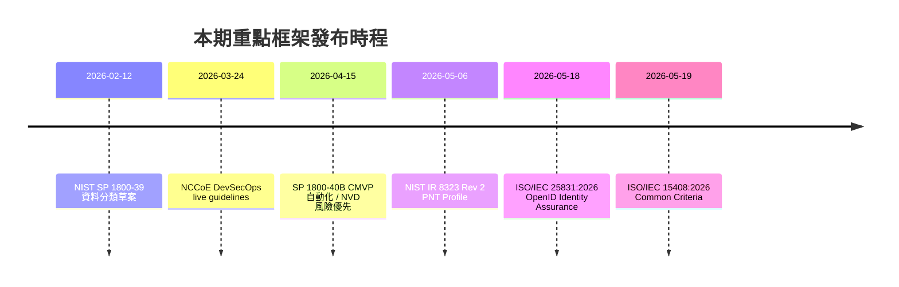

# Rule Change Brief — 2026-W25 {: .no_toc }

本期重點：NIST IR 8323 Revision 2（PNT Profile）草案改版以對齊 CSF 2.0，進入公開意見徵詢；NIST SP 1800-40B 草案推動密碼模組驗證計畫（CMVP）自動化；NIST NVD 改採「風險優先」模型重新定義 CVE 豐富化範圍；ISO/IEC 15408:2026（Common Criteria）完成第五版改版；ISO/IEC 25831:2026 OpenID Identity Assurance 標準正式發布。CISA KEV 持續追蹤 4 項已遭利用弱點。

> 本期追蹤 50 項框架與標準變動，涵蓋 nist_frameworks、nist_cybersecurity_insights、iso_standards、cisa_kev、eu_regulations 等資料源。

## 免責聲明 {: .no_toc }

本簡報由 AI 系統自動產出，基於公開資料源萃取與結構化分析。
內容僅供參考，不構成法律或合規建議。所有資訊應以原始發布機構
的正式文件為準。標註「推測」之內容為系統推論，尚未經人工驗證。

---

## 報告資訊 {: .no_toc }

| 項目 | 內容 |
|------|------|
| 產出方式 | AI 自動產出（Claude Opus 4.8） |
| 審核狀態 | 已通過自動審核 |
| 審核依據 | CLAUDE.md 自我審核 Checklist |
| 資料來源 | 50 個權威來源（NIST、ISO、CISA、EUR-Lex 等） |
| 資料時間 | 2024-02-26 ~ 2026-06-05 |

---



## 本期重點

  <strong>NIST IR 8323 Revision 2（PNT Profile）草案改版以對齊 CSF 2.0</strong>（revision，enforcement_signal: recommended），定位、導航與授時系統使用者的風險管理責任範圍擴大，目前處於公開意見徵詢階段。

1. **NIST IR 8323 Rev 2 PNT Profile 對齊 CSF 2.0（revision，enforcement_signal: recommended）**：NIST NCCoE 發布 IR 8323 Revision 2 草案，將定位、導航與授時（PNT）系統的安全配置重新對齊至 CSF 2.0 架構，狀態為 public_comment。使用 PNT 系統的關鍵基礎設施營運者、聯邦機構與資安風險管理者需評估現有 PNT 風險管理做法是否符合 CSF 2.0。（[來源](https://www.nist.gov/news-events/news/2026/05/draft-pnt-profile-updated-align-nist-csf-20)）

2. **NIST SP 1800-40B 推動 CMVP 自動化（draft，enforcement_signal: informational）**：NIST NCCoE 發布密碼模組驗證計畫（CMVP）自動化草案，狀態為 public_comment。密碼模組供應商、測試實驗室與驗證機構需採用新的標準化提交協定與雲端原生基礎設施，以符合現代化 CMVP 要求。（[來源](https://www.nist.gov/news-events/news/2026/04/new-publication-automation-nist-cryptographic-module-validation-program)）

3. **NIST NVD 改採風險優先 CVE 豐富化模型（revision，enforcement_signal: informational）**：為因應創紀錄的 CVE 成長，NIST 重新定義 NVD 的 CVE 豐富化範圍（狀態：final），聯邦機構與 CISA KEV 目錄中的 CVE 優先處理，其餘 CVE 的豐富化時程將視資源調整。依賴 NVD 豐富化資料的組織需重新評估其漏洞管理流程。（[來源](https://www.nist.gov/news-events/news/2026/04/nist-updates-nvd-operations-address-record-cve-growth)）

4. **ISO/IEC 15408:2026 Common Criteria 改版（revision，enforcement_signal: recommended）**：Common Criteria 第五版於 2026 年正式發布，含 Part 2 安全功能元件（第 5 版，[來源](https://www.iso.org/standard/88135.html)）與 Part 4 評估方法與活動規範框架（第 2 版，[來源](https://www.iso.org/standard/88138.html)），強調評估的客觀性、可重複性與可再現性，影響 IT 安全評估員、產品開發者與認證方案營運者。

5. **ISO/IEC 25831:2026 OpenID Identity Assurance 正式發布（new，enforcement_signal: recommended）**：建立 OpenID 身分保證機制的 ISO 標準化框架，含 Part 1 通則（[來源](https://www.iso.org/standard/91663.html)）與 Part 2 結構定義（[來源](https://www.iso.org/standard/91664.html)），定義驗證聲明（verified claims）請求與提供的技術機制，影響身分提供者、信賴方與身分管理系統架構師。

<blockquote class="expert-quote">
  「The catalog revision is part of NIST's response to a recent executive order on strengthening the nation's cybersecurity.」
  <cite>NIST — SP 800-53 Rev. 5.2.0 control catalog revision</cite>
</blockquote>

---

## 按風險領域分析

### Cybersecurity

NIST IR 8323 Rev 2 PNT Profile 對齊 CSF 2.0、CMVP 自動化草案 SP 1800-40B、NVD 改採風險優先 CVE 豐富化、ISO/IEC 15408:2026 Common Criteria 改版、Transit CSF Community Profile（IR 8576）草案，以及 CISA KEV 4 項弱點修復追蹤為本期重點。

**NIST IR 8323 Revision 2 — PNT Profile**（revision，2026-05-06，public_comment）
- 將 PNT 系統安全配置重新對齊至 CSF 2.0；徵集公開意見
- 影響對象：PNT 系統使用者、關鍵基礎設施營運者、聯邦機構、資安風險管理者
- enforcement_signal：recommended
- （[來源](https://www.nist.gov/news-events/news/2026/05/draft-pnt-profile-updated-align-nist-csf-20)）

**NIST SP 1800-40B — CMVP 自動化**（draft，2026-04-15，public_comment）
- 密碼模組驗證流程走向自動化，導入標準化提交協定與雲端原生基礎設施
- 影響對象：密碼模組供應商、測試實驗室、驗證機構、聯邦機構
- enforcement_signal：informational
- （[來源](https://www.nist.gov/news-events/news/2026/04/new-publication-automation-nist-cryptographic-module-validation-program)）

**NIST NVD 營運更新（風險優先 CVE 豐富化）**（revision，2026-04-15，final）
- 採風險優先模型；聯邦相關與 CISA KEV 目錄 CVE 優先豐富化
- 影響對象：資安從業人員、CVE 編號機構（CNA）、軟體供應商、依賴 NVD 的組織
- enforcement_signal：informational
- （[來源](https://www.nist.gov/news-events/news/2026/04/nist-updates-nvd-operations-address-record-cve-growth)）

**ISO/IEC 15408-2:2026 安全功能元件**（revision，2026-05-19，final，第 5 版）
- Common Criteria 安全功能元件目錄改版
- 影響對象：IT 安全評估員、產品開發者、安全架構師
- enforcement_signal：recommended
- （[來源](https://www.iso.org/standard/88135.html)）

**ISO/IEC 15408-4:2026 評估方法與活動框架**（revision，2026-05-19，final，第 2 版）
- 更新評估方法與活動規範框架，強調客觀性、可重複性與可再現性
- 影響對象：IT 安全評估員、評估方法撰寫者、認證方案營運者
- enforcement_signal：recommended
- （[來源](https://www.iso.org/standard/88138.html)）

**NIST SP 1800-39 資料分類實務指引**（draft，2026-02-12，public_comment）
- 資料分類實務草案指引，徵集公開意見
- 影響對象：企業與聯邦機構、資料安全官、IT 管理者
- enforcement_signal：recommended
- （[來源](https://www.nist.gov/news-events/news/2026/02/comment-now-draft-guidelines-data-classification-practices)）

**NIST IR 8576 交通運輸 CSF Community Profile**（draft，2026-01-22，public_comment）
- 將 CSF 2.0 成果映射至交通運輸業特定指引
- 影響對象：交通運輸機構與營運者、OT/IT 安全管理者
- enforcement_signal：recommended
- （[來源](https://www.nist.gov/news-events/news/2026/01/now-available-transit-cybersecurity-framework-community-profile)）

**慶祝 CSF 2.0 兩週年**（guidance，2026-02-24，final）
- 新增七份草案社群檔案（AI、事件回應、製造業、半導體、PNT、勒索軟體、交通運輸）與七份資訊性參考文件
- 影響對象：各規模組織 CISO、資安主管、供應鏈管理人員
- enforcement_signal：informational
- （[來源](https://www.nist.gov/blogs/cybersecurity-insights/celebrating-two-years-csf-20)）

**NIST 慶祝 2026 全國中小企業週**（guidance，2026-05-04，final）
- 為中小企業推出新資安資源，擴展資安韌性支援範圍
- 影響對象：中小企業主、安全從業人員、政策制定者
- enforcement_signal：informational
- （[來源](https://www.nist.gov/blogs/cybersecurity-insights/stronger-cybersecurity-stronger-business-nist-celebrates-2026-national)）

**NIST SP 800-53 Rev. 5.2.0 持續落實**（revision，2025-08-27，final）
- 三項新控制項（SA-15 日誌語法、SI-02(07) 根因分析、SA-24 韌性設計）回應行政命令，持續影響聯邦機關 SSP 更新
- 影響對象：聯邦機關、承包商、FedRAMP 雲端服務提供者
- enforcement_signal：mandatory
- （[來源](https://www.nist.gov/news-events/news/2025/08/nist-revises-security-and-privacy-control-catalog-improve-software-update)）

**SUSHI@NIST 次世代安全硬體**（guidance，2026-01-28）
- 發展半導體開發生命週期安全框架，涵蓋硬體層級威脅防護
- 影響對象：半導體製造商、硬體安全研究者、關鍵基礎設施營運者
- enforcement_signal：informational
- [REVIEW_NEEDED]（工作坊公告，非正式規範文件）
- （[來源](https://www.nist.gov/news-events/events/2026/01/sushinist-rolling-next-generation-secure-hardware-standards)）

**CISA KEV 強制修復弱點**（new / mandatory，多項）
- CVE-2026-24858：Fortinet 多產品認證繞過（修復期限 2026-01-30）（[來源](https://www.cisa.gov/known-exploited-vulnerabilities-catalog#CVE-2026-24858)）
- CVE-2026-20805：Microsoft Windows 資訊洩露（修復期限 2026-02-03）（[來源](https://www.cisa.gov/known-exploited-vulnerabilities-catalog#CVE-2026-20805)）
- CVE-2025-31125：Vite 存取控制不當（修復期限 2026-02-12）（[來源](https://www.cisa.gov/known-exploited-vulnerabilities-catalog#CVE-2025-31125)）
- CVE-2021-39935：GitLab CE/EE SSRF（修復期限 2026-02-24）（[來源](https://www.cisa.gov/known-exploited-vulnerabilities-catalog#CVE-2021-39935)）
- enforcement_signal：mandatory（BOD 22-01）

### AI Risk

NIST 第二次 Cyber AI Profile 工作坊彙整社群意見、推進 CSF Profile for AI 下一版草案；CSF 與 AI RMF 整合方向持續演進。

**NIST 第二次 Cyber AI Profile 工作坊反思**（draft，2026-03-23，public_comment）
- 彙整社群意見，推進 CSF Profile for AI（Cyber AI Profile）下一版草案制定
- 影響對象：AI 系統開發者、資安框架實作者、政策制定者
- enforcement_signal：recommended
- （[來源](https://www.nist.gov/blogs/cybersecurity-insights/reflections-second-nist-cyber-ai-profile-workshop)）

**CSF 與 AI RMF 整合方向**（guidance，2025-05-22）
- NIST 持續推動網路安全框架與 AI 風險管理框架的整合
- 影響對象：網路安全實務人員、AI 系統開發者
- enforcement_signal：informational
- （[來源](https://www.nist.gov/blogs/cybersecurity-insights/cybersecurity-and-ai-integrating-and-building-existing-nist-guidelines)）

### Privacy

NIST Privacy Framework 1.1 即將發布並與 CSF 2.0 對齊，SP 800-226 差分隱私指引已正式發布，差分隱私部署登錄庫開放業界貢獻。

**NIST Privacy Framework 1.1 即將發布**（guidance，2026-01-27）
- 將與 CSF 2.0 重新對齊，新增中小企業快速啟動指南；SP 800-226 差分隱私指引已正式發布、NIST IR 8588 草案中
- 影響對象：隱私從業人員、隱私官、中小企業經營者、資訊安全主管
- enforcement_signal：recommended
- （[來源](https://www.nist.gov/blogs/cybersecurity-insights/celebrating-data-privacy-week-nists-privacy-engineering-program)）

### Supply Chain

NCCoE 發布 SSDF 驅動的 DevSecOps live guidelines（附首個 Azure 實作範例）、SSDF 1.2 公開意見徵詢、NIST IR 8536 供應鏈可追溯性框架持續推進。

**NCCoE DevSecOps 安全開發/維運 live guidelines**（guidance，2026-03-24，public_comment）
- SSDF 驅動的 DevSecOps live document，示範如何將 SSDF 安全實踐整合至現代 DevSecOps pipeline，附首個 Microsoft Azure 實作範例
- 影響對象：軟體開發組織、DevSecOps 實踐者、軟體供應鏈安全負責人
- enforcement_signal：recommended
- （[來源](https://www.nist.gov/news-events/news/2026/03/new-live-guidelines-secure-software-development-security-and-operations)）

**SSDF Version 1.2 公開意見徵詢**（draft，2025-12-17，public_comment）
- 安全軟體開發框架 1.2 版開放公開意見
- 影響對象：軟體開發者、DevSecOps 團隊、軟體供應商
- enforcement_signal：recommended
- （[來源](https://www.nist.gov/news-events/news/2025/12/secure-software-development-framework-ssdf-version-12-available-public)）

**NIST IR 8536 供應鏈可追溯性框架**（draft，2025-07-31，public_comment）
- 製造業元框架第二次公開草案，建構供應鏈可追溯性標準
- 影響對象：製造商、供應鏈管理者、合規團隊
- enforcement_signal：recommended
- （[來源](https://www.nist.gov/news-events/news/2025/07/comment-now-nist-internal-report-8536-supply-chain-traceability)）

**NIST IoT 製造商安全指引修訂**（guidance，持續中）
- NISTIR 8259 系列修訂，聚焦產品安全要求與網路安全風險
- 影響對象：IoT 產品製造商、供應鏈管理者
- enforcement_signal：recommended
- （[來源](https://www.nist.gov/blogs/cybersecurity-insights/sharpening-focus-product-requirements-and-cybersecurity-risks-updating)）

### Identity

ISO/IEC 25831:2026 OpenID Identity Assurance 標準正式發布（Part 1 通則 + Part 2 結構定義）；NIST IR 8523 刑事司法多因素驗證指引正式發布；SP 800-63B 同步式驗證器補充文件提供 Passkeys 過渡期指引。

**ISO/IEC 25831-1:2026 — OpenID Identity Assurance Part 1: General**（new，2026-05-18，final）
- 建立 OpenID 身分保證機制的標準化框架，定義驗證聲明請求與提供的技術機制
- 影響對象：身分提供者（OpenID Provider）、信賴方（Relying Party）、身分管理系統架構師、合規與隱私官員
- enforcement_signal：recommended
- （[來源](https://www.iso.org/standard/91663.html)）

**ISO/IEC 25831-2:2026 — OpenID Identity Assurance Part 2: Schema Definition**（new，2026-05-18，final）
- 定義 OpenID 身分保證 JSON 物件的結構
- 影響對象：身分管理系統開發者、JWT 聲明實作者、OpenID 提供者
- enforcement_signal：recommended
- （[來源](https://www.iso.org/standard/91664.html)）

**NIST IR 8523 刑事司法多因素驗證**（final，2025-09-03）
- 刑事司法資訊系統的多因素驗證指引正式發布
- 影響對象：執法機關、刑事司法資訊系統管理者
- enforcement_signal：recommended
- （[來源](https://www.nist.gov/news-events/news/2025/09/final-publication-available-nist-ir-8523-multi-factor-authentication)）

**SP 800-63B 同步式驗證器補充文件**（guidance，2024-04-22）
- Passkeys 等同步式驗證器過渡期指引
- 影響對象：聯邦機關、身份驗證系統提供者
- enforcement_signal：recommended
- （[來源](https://www.nist.gov/blogs/cybersecurity-insights/giving-nist-digital-identity-guidelines-boost-supplement-incorporating)）

### Critical Infrastructure

NIST IR 8349 IoT 設備特性分析與安全指引正式發布；PNT Profile（IR 8323 Rev 2）涵蓋關鍵基礎設施 PNT 風險；Transit CSF Community Profile（IR 8576）服務交通運輸基礎設施。

**NIST IR 8349 IoT 設備特性分析與安全**（final，2025-08-28）
- IoT 設備特性分析與保護指引正式發布
- 影響對象：IoT 設備管理者、網路安全團隊、關鍵基礎設施營運者
- enforcement_signal：recommended
- （[來源](https://www.nist.gov/news-events/news/2025/08/final-nist-ir-8349-released-characterize-secure-your-iot-devices)）

**NIST IR 8323 Rev 2 PNT Profile（關鍵基礎設施面向）**（revision，2026-05-06，public_comment）
- 涵蓋 PNT 系統的關鍵基礎設施風險管理；詳見 Cybersecurity 段落
- 影響對象：關鍵基礎設施營運者、PNT 系統使用者
- enforcement_signal：recommended
- （[來源](https://www.nist.gov/news-events/news/2026/05/draft-pnt-profile-updated-align-nist-csf-20)）

> 本期 Financial Compliance 領域亦有 EU CFSP 制裁措施勘誤（Iran SWIFT 代碼更正、Russia 限制措施修訂），雖非本 Mode 預設六大風險領域，仍列入「責任變動追蹤」供參考。

---

## 責任變動追蹤

本期責任變動以 NIST PNT Profile 對齊 CSF 2.0、CMVP 驗證流程自動化、NVD 風險優先豐富化、ISO Common Criteria 與 OpenID 身分保證標準更新，以及 CISA KEV 持續修復要求為主要關注點。

<table class="comparison-table">
  <thead>
    <tr>
      <th>文件</th>
      <th>affected_roles</th>
      <th>shift_type</th>
      <th>shift_summary</th>
    </tr>
  </thead>
  <tbody>
    <tr>
      <td>NIST IR 8323 Rev 2（PNT Profile）</td>
      <td>PNT 系統使用者、關鍵基礎設施營運者、聯邦機構、資安風險管理者</td>
      <td>expanded</td>
      <td>PNT 風險管理責任擴大，需依 CSF 2.0 更新 PNT 安全配置（public_comment）</td>
    </tr>
    <tr>
      <td>NIST SP 1800-40B（CMVP 自動化）</td>
      <td>密碼模組供應商、測試實驗室、驗證機構、聯邦機構</td>
      <td>new</td>
      <td>密碼模組驗證走向自動化，需採標準化提交協定與雲端原生基礎設施</td>
    </tr>
    <tr>
      <td>NIST NVD 營運更新</td>
      <td>資安從業人員、CNA、軟體供應商、依賴 NVD 的組織</td>
      <td>clarified</td>
      <td>改採風險優先 CVE 豐富化，組織須重新評估漏洞管理對 NVD 的依賴</td>
    </tr>
    <tr>
      <td>ISO/IEC 15408-2 / 15408-4:2026</td>
      <td>IT 安全評估員、產品開發者、認證方案營運者</td>
      <td>clarified</td>
      <td>Common Criteria 改版，強調評估客觀性、可重複性與可再現性</td>
    </tr>
    <tr>
      <td>ISO/IEC 25831-1 / 25831-2:2026</td>
      <td>身分提供者、信賴方、身分管理系統架構師</td>
      <td>new</td>
      <td>建立 OpenID 身分保證機制的 ISO 標準化框架與結構定義</td>
    </tr>
    <tr>
      <td>NCCoE DevSecOps live guidelines</td>
      <td>軟體開發組織、DevSecOps 實踐者、供應鏈安全負責人</td>
      <td>expanded</td>
      <td>SSDF 安全實踐整合至 DevSecOps pipeline，附首個 Azure 實作範例</td>
    </tr>
    <tr>
      <td>NIST SP 800-53 Rev. 5.2.0</td>
      <td>聯邦機關、軟體開發者、系統管理者</td>
      <td>expanded</td>
      <td>三項新控制項持續落實，責任涵蓋韌性設計與失敗根因分析</td>
    </tr>
    <tr>
      <td>ISO/IEC 18033-2:2006/Amd 2:2026</td>
      <td>密碼學工程師、資安技術架構師、加密演算法實作開發人員</td>
      <td>expanded</td>
      <td>非對稱密碼演算法規格修正案，影響加密實作合規基線</td>
    </tr>
    <tr>
      <td>CVE-2026-24858（Fortinet）</td>
      <td>使用 Fortinet 產品的組織</td>
      <td>new</td>
      <td>認證繞過弱點，聯邦機構須依 BOD 22-01 於 2026-01-30 前修復</td>
    </tr>
    <tr>
      <td>EU CFSP 2025/1978 勘誤（Iran SWIFT）</td>
      <td>金融機構、制裁合規官、會員國主管機關</td>
      <td>clarified</td>
      <td>Iran 限制措施 SWIFT 代碼更正，直接適用</td>
    </tr>
  </tbody>
</table>

---

## L5 — Evolution Signals

- [系統推論] **NIST 框架治理正全面收斂至 CSF 2.0 作為共同骨架** — 本期 PNT Profile（IR 8323 Rev 2）改版對齊 CSF 2.0、Transit Community Profile（IR 8576）映射 CSF 2.0、Cyber AI Profile 持續以 CSF 為基礎延伸，加上 CSF 2.0 兩週年新增七份產業社群檔案，顯示 NIST 正以 CSF 2.0 為統一治理骨架，將各產業與新興風險（PNT、交通、AI）的專屬指引收斂為可互通的 Profile 體系。組織宜以 CSF 2.0 為基準建立跨領域風險映射。

- [系統推論] **驗證與漏洞作業正從「人工逐案」轉向「自動化與風險優先」** — CMVP 自動化草案（SP 1800-40B）導入標準化提交與雲端原生基礎設施，NVD 因應創紀錄 CVE 成長改採風險優先豐富化模型，兩者皆反映合規驗證與漏洞情報的處理量已超出傳統人工流程負荷。依賴 CMVP 驗證或 NVD 豐富化資料的組織需預期作業模式與時程的結構性改變。

- [系統推論] **國際標準（ISO/IEC）密集改版正抬升技術合規基線** — 本期 ISO/IEC 15408:2026（Common Criteria 第 5 版）、ISO/IEC 25831:2026（OpenID Identity Assurance）、ISO/IEC 25706:2026（SPDM）與 ISO/IEC 18033-2 Amd 2 等多項基礎安全標準集中更新，定義了產品評估、身分保證與密碼實作的新基線。宣稱符合 Common Criteria 或相關 ISO 標準的產品需重新檢視其符合的版本。

---

## 統計

| 指標 | 數值 |
|------|------|
| 總變動數 | 50 |
| rule_type 分布 | guidance: 11, draft: 10, revision: 8, new: 7, amendment: 6, final: 4, 其他/未分類: 4 |
| enforcement_signal 分布 | recommended: 24, mandatory: 11, informational: 11, 未分類: 4 |
| REVIEW_NEEDED | 2 筆（SUSHI@NIST 工作坊公告、ISO/IEC 23092-5 基因組資訊修正案） |

---

## 資料來源

| Layer | 筆數 | 時間範圍 |
|-------|------|----------|
| nist_frameworks | 22 | 2025-07-22 ~ 2026-05-06 |
| nist_cybersecurity_insights | 13 | 2024-02-26 ~ 2026-05-04 |
| iso_standards | 8 | 2026-02-03 ~ 2026-06-05 |
| cisa_kev | 4 | 2026-01-13 ~ 2026-02-03 |
| eu_regulations | 3 | 2026-01-29 ~ 2026-02-02 |
| **總計** | **50** | **2024-02-26 ~ 2026-06-05** |
