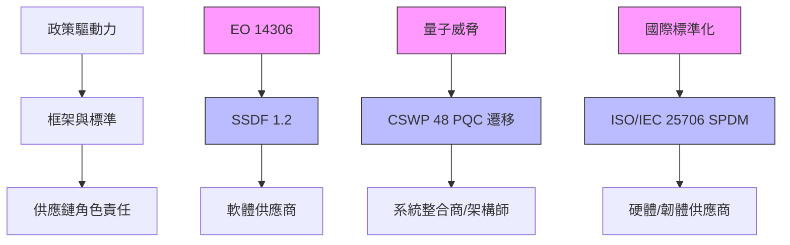

# Supply Chain Security Trends — 2026-W13 {: .no_toc }

本週重點：ISO/IEC 25706:2026 SPDM 標準正式發布，為硬體供應鏈設備驗證與安全通訊建立國際標準化基礎；CSA 提出第三方風險管理（TPRM）範式轉型，從勾選式評估走向風險工程方法；NIST SSDF 1.2 與 SP 800-53 修補管理控制持續推進最終版本；供應鏈軟體漏洞（SolarWinds、GitLab、Vite、Versa Concerto）持續被列入 CISA KEV，凸顯軟體與硬體供應鏈安全管理的雙重急迫性。

> **報告週期**：2026-03-17 至 2026-03-23
>
> 本期追蹤 14 項供應鏈安全動態，涵蓋 NIST 框架、NIST 洞察、歐盟法規、ISO 標準、CSA 指引。

## 免責聲明

本報告由 AI 系統自動產出，基於公開資料源萃取與結構化分析。內容僅供參考，不構成法律或合規建議。所有資訊應以原始發布機構的正式文件為準。標註「[系統推論]」之內容為系統推論，尚未經人工驗證。

---

## 報告資訊 {: .no_toc }

| 項目 | 內容 |
|------|------|
| 產出方式 | AI 自動產出（Claude Opus 4.5） |
| 審核狀態 | 已通過自動審核 |
| 審核依據 | CLAUDE.md 自我審核 Checklist |
| 資料來源 | 14 個權威來源（NIST、EUR-Lex、ISO、CSA、CISA 等） |
| 資料時間 | 2024-11-21 ~ 2026-03-06 |

---



---

## 本週重點

  <strong>ISO/IEC 25706:2026 SPDM 標準正式發布，為硬體供應鏈設備驗證建立國際標準</strong>；CSA 提出 TPRM 範式轉型，從問卷式評估走向攻擊者視角的風險工程方法；SSDF 1.2 進入最終發布階段，軟體供應鏈合規壓力持續升高。

1. **ISO/IEC 25706:2026 SPDM 硬體驗證標準發布（國際，new）**：ISO/IEC 正式發布 Security Protocol and Data Model（SPDM）標準集合，定義裝置身份驗證與安全通訊協定。此標準為硬體與韌體供應鏈的設備驗證、完整性檢查與安全通訊提供國際標準化基礎，影響資訊安全架構師、硬體安全工程師、韌體開發人員與設備供應商。（[來源](https://www.iso.org/standard/91251.html)）

2. **CSA 第三方風險管理範式轉型（國際，guidance）**：Cloud Security Alliance 發布指引指出，傳統勾選式第三方風險管理（Checkbox TPRM）已無法應對供應商數量爆增的挑戰，組織應轉向「風險工程」方法——盤點供應商實際技術連接、以攻擊者視角評估風險、執行針對性漏洞測試，並依發現結果立即採取修復行動（撤銷權限、修改合約條款、更換供應商）。（[來源](https://cloudsecurityalliance.org/articles/checkbox-tprm-is-dead-start-engineering-risk)）

3. **SSDF 1.2 持續推進最終版本（美國 NIST，revision）**：NIST SP 800-218r1 公開徵詢期已截止（截止日 2026-01-30），引入改進的安全開發實踐與漏洞根因分析要求，擴展軟體供應商與採購方的責任。受 Executive Order 14306 推動，預期近期發布最終版本。（[來源](https://www.nist.gov/news-events/news/2025/12/secure-software-development-framework-ssdf-version-12-available-public)）

4. **供應鏈軟體漏洞持續被利用（美國 CISA，final）**：多項供應鏈關鍵軟體漏洞被列入 CISA KEV 目錄，包括 Versa Concerto（CVE-2025-34026，不當驗證）、SolarWinds Web Help Desk（CVE-2025-40551，反序列化）、GitLab CE/EE（CVE-2021-39935，SSRF）、Vite（CVE-2025-31125，不當存取控制）、Sangoma FreePBX（CVE-2025-64328，OS 命令注入），凸顯軟體供應鏈攻擊面持續擴大。（[來源](https://www.cisa.gov/known-exploited-vulnerabilities-catalog)）

5. **PQC 遷移風險框架映射指引（美國 NIST，draft）**：NIST 發布 CSWP 48 白皮書草案，提供後量子密碼學（PQC）遷移能力與現有風險框架文件之間的映射指引，協助組織評估加密演算法轉換對供應鏈安全的影響。（[來源](https://www.nist.gov/news-events/news/2025/09/new-draft-white-paper-pqc-migration-mappings-risk-framework-docs)）

<blockquote class="expert-quote">
  「傳統勾選式第三方風險管理無法應對現代供應商數量爆增的挑戰，組織應轉向風險工程方法——分析實際供應商連接、執行針對性技術測試並採取具體行動。」
  <cite>Cloud Security Alliance (CSA), "Checkbox TPRM is Dead. Start Engineering Risk."</cite>
</blockquote>

---

## 區域動態比較

### 美國（NIST）

  <strong>SSDF 1.2 進入最終發布階段</strong>，SP 800-53 修補管理控制草案持續審議，IR 8536 製造業供應鏈追溯性元框架維持公開徵詢，PQC 遷移風險映射指引草案提供密碼學轉型對供應鏈的影響評估。

<table class="comparison-table">
  <thead>
    <tr>
      <th>框架/指引</th>
      <th>文件編號</th>
      <th>狀態</th>
      <th>重點內容</th>
    </tr>
  </thead>
  <tbody>
    <tr>
      <td><strong>SSDF 1.2 版</strong></td>
      <td>SP 800-218r1</td>
      <td>public_comment（徵詢期已截止）</td>
      <td>安全軟體開發實務擴充，漏洞根因分析，受 EO 14306 推動</td>
    </tr>
    <tr>
      <td><strong>SP 800-53 修補管理控制</strong></td>
      <td>SP 800-53 Release 5.2.0</td>
      <td>draft / public_comment</td>
      <td>修補程式安全部署控制，組織與開發者責任劃分</td>
    </tr>
    <tr>
      <td><strong>供應鏈追溯性元框架</strong></td>
      <td>NIST IR 8536</td>
      <td>public_comment（第二版草案）</td>
      <td>製造業供應鏈可見性與追溯性管理，元件來源驗證</td>
    </tr>
    <tr>
      <td><strong>安全軟體開發實踐指引</strong></td>
      <td>SP 1800-44</td>
      <td>draft</td>
      <td>DevSecOps 安全軟體開發實踐聯盟指引</td>
    </tr>
    <tr>
      <td><strong>IoT 製造商基礎活動</strong></td>
      <td>IR 8259（修訂中）</td>
      <td>draft / public_comment</td>
      <td>新增 Activity 0（威脅建模），擴大 pre-market/post-market 活動</td>
    </tr>
    <tr>
      <td><strong>PQC 遷移風險映射</strong></td>
      <td>CSWP 48</td>
      <td>draft</td>
      <td>後量子密碼學遷移能力與風險框架文件映射</td>
    </tr>
  </tbody>
</table>

**重點觀察**：

- **SSDF 1.2 進入最終審議**：SP 800-218r1 公開徵詢期已於 2026-01-30 截止，預期近期發布最終版本。軟體供應商應提前準備合規文件，特別是漏洞減少指標、安全開發實踐文件與根因分析報告。此框架受 Executive Order 14306 推動，對聯邦採購合約的供應鏈安全要求影響深遠。

- **PQC 遷移對供應鏈的影響浮現**：NIST CSWP 48 白皮書草案將 PQC 遷移能力映射到現有風險框架，顯示密碼學轉換不僅是技術議題，更涉及供應鏈中各環節的演算法依賴評估與風險管理。CISO 與加密系統管理員須評估供應鏈中的加密演算法使用現況。

- **供應鏈軟體漏洞被活躍利用**：Versa Concerto（CVE-2025-34026）、SolarWinds（CVE-2025-40551）、GitLab（CVE-2021-39935）、Vite（CVE-2025-31125）、Sangoma FreePBX（CVE-2025-64328）等供應鏈關鍵軟體漏洞被列入 CISA KEV，強化了 SSDF 與 SP 800-53 修補管理控制的政策必要性。

### 歐盟

  <strong>人源物質品質安全法規勘誤持續生效</strong>，釐清 SoHO 機構授權要求與快速警報觸發條件，影響人源物質供應鏈的品質管控流程。

<table class="comparison-table">
  <thead>
    <tr>
      <th>法規</th>
      <th>文件編號</th>
      <th>binding_force</th>
      <th>重點內容</th>
    </tr>
  </thead>
  <tbody>
    <tr>
      <td><strong>人源物質品質安全勘誤</strong></td>
      <td>Regulation (EU) 2024/1938 Corrigendum</td>
      <td>directly_applicable</td>
      <td>釐清 SoHO 機構授權要求與快速警報觸發條件</td>
    </tr>
  </tbody>
</table>

**重點觀察**：

- **SoHO 供應鏈合規要求釐清**：Regulation (EU) 2024/1938 勘誤持續生效，釐清人源物質（Substances of Human Origin）機構的授權要求與快速警報觸發條件。SoHO 機構、主管機關與 EU SoHO Platform 操作人員須確認其流程符合修正後的要求。此法規為 directly_applicable，無需各成員國轉化即直接生效。

- **本週歐盟供應鏈相關動態較少**：上週的建材法規勘誤（Regulation 2024/3110）與伊朗制裁擴大（Regulation 2026/271）已生效，本週未有新增重大歐盟供應鏈法規。組織應持續關注已生效法規的實施細則。

### 國際標準（ISO/IEC）

  <strong>ISO/IEC 25706:2026 SPDM 標準正式發布</strong>，為硬體供應鏈的設備身份驗證與安全通訊建立國際標準化基礎。

- **ISO/IEC 25706:2026 SPDM 標準**：此標準定義 Security Protocol and Data Model（SPDM）集合，為裝置身份驗證與安全通訊提供協定規範，適用於硬體與韌體安全領域。設備供應商須評估其產品是否需符合此標準的驗證與通訊要求。（[來源](https://www.iso.org/standard/91251.html)）

---

## 供應鏈責任矩陣

  <strong>硬體供應商新增 SPDM 設備驗證責任</strong>：須評估產品是否符合 ISO/IEC 25706:2026 標準。TPRM 分析師須從勾選式評估轉向風險工程方法。軟體供應商面臨 SSDF 1.2 與漏洞修補雙重壓力。

<table class="comparison-table">
  <thead>
    <tr>
      <th>角色</th>
      <th>美國要求</th>
      <th>歐盟要求</th>
      <th>本週變動趨勢</th>
    </tr>
  </thead>
  <tbody>
    <tr>
      <td><strong>軟體供應商</strong></td>
      <td>SSDF 1.2 實務作法、修補程式完整性驗證（SP 800-53）、SBOM 揭露、DevSecOps（SP 1800-44）</td>
      <td>—</td>
      <td>SSDF 進入最終階段，KEV 漏洞凸顯修補急迫性</td>
    </tr>
    <tr>
      <td><strong>硬體/韌體供應商</strong></td>
      <td>—</td>
      <td>—</td>
      <td>ISO/IEC 25706 SPDM 標準發布，設備驗證標準化</td>
    </tr>
    <tr>
      <td><strong>採購方</strong></td>
      <td>要求供應商提供 SSDF 合規證明、SBOM 驗證、威脅建模文件</td>
      <td>供應鏈來源驗證</td>
      <td>供應商評估標準持續強化</td>
    </tr>
    <tr>
      <td><strong>TPRM 分析師/風險管理團隊</strong></td>
      <td>—</td>
      <td>—</td>
      <td>CSA 建議從勾選式轉向風險工程方法</td>
    </tr>
    <tr>
      <td><strong>系統整合商</strong></td>
      <td>供應鏈追溯性機制（IR 8536）、元件來源驗證、PQC 遷移評估（CSWP 48）</td>
      <td>—</td>
      <td>追溯性標準與密碼學遷移議題同步推進</td>
    </tr>
    <tr>
      <td><strong>IoT 製造商</strong></td>
      <td>上市前威脅建模（IR 8259 Activity 0）、產品生態系安全</td>
      <td>—</td>
      <td>標準持續推進</td>
    </tr>
    <tr>
      <td><strong>SoHO 機構</strong></td>
      <td>—</td>
      <td>授權要求與快速警報觸發條件（Regulation 2024/1938 勘誤）</td>
      <td>合規要求釐清</td>
    </tr>
  </tbody>
</table>

---

## 責任變動追蹤

  <strong>新增兩項重要標準與指引</strong>：ISO/IEC 25706 SPDM 硬體驗證標準發布，CSA TPRM 範式轉型指引發布。美國方面 SSDF 1.2、修補管理控制與 PQC 遷移指引持續推進。

| 來源 | 文件 | affected_roles | shift_type | shift_summary |
|------|------|---------------|------------|---------------|
| ISO/IEC | ISO/IEC 25706:2026 | 資訊安全架構師、硬體安全工程師、韌體開發人員、設備供應商 | new | SPDM 硬體驗證標準發布，建立裝置身份驗證與安全通訊國際標準 |
| CSA | Checkbox TPRM is Dead | TPRM 分析師、風險管理團隊、合規主管、安全工程師、CISO | expanded | 第三方風險管理從勾選式轉向風險工程方法 |
| NIST | SP 800-218r1 (SSDF 1.2) | 軟體生產者、軟體開發者、軟體採購方、聯邦機構 | expanded | SSDF 1.2 進入最終發布階段，擴大漏洞風險緩解責任 |
| NIST | SP 800-53 Release 5.2.0 | 聯邦機構（系統管理員、資安團隊）、軟體開發者 | expanded | 修補程式安全部署控制草案，劃分組織與開發者責任 |
| NIST | CSWP 48 | CISO、加密系統管理員、風險管理人員、系統架構師 | new | PQC 遷移能力與風險框架文件映射指引 |
| NIST | SP 1800-44 | 軟體開發團隊、DevSecOps 工程師、軟體供應商 | new | DevSecOps 安全軟體開發實踐聯盟指引 |
| NIST | NIST IR 8536 | 製造業組織、供應鏈管理者、合規官 | expanded | 製造業供應鏈追溯性元框架持續徵詢 |
| NIST | NIST IR 8259 | IoT 製造商、產品安全工程師、生命週期管理者 | expanded | IoT 基礎活動修訂，新增 Activity 0 威脅建模 |
| CISA | CISA KEV（5 項供應鏈軟體漏洞） | IT 管理員、資安團隊、軟體採購方 | expanded | Versa Concerto、SolarWinds、GitLab、Vite、FreePBX 漏洞被列入 KEV |
| EU | Regulation (EU) 2024/1938 Corrigendum | SoHO 機構、主管機關、EU SoHO Platform 操作人員 | clarified | 釐清授權要求與快速警報觸發條件 |

---

## 義務與舉證要求

### 新增義務摘要

  <strong>SBOM 義務持續強化</strong>：SSDF 1.2 進入最終發布階段，軟體供應商須維護 SBOM 並支援漏洞追蹤。ISO/IEC 25706 SPDM 為硬體供應鏈新增設備驗證義務。CSA 指引要求組織以工程化方法管理第三方風險。

**硬體供應鏈驗證義務（ISO/IEC 25706:2026）**：
- 設備供應商應評估產品是否符合 SPDM 驗證與通訊標準
- 硬體安全工程師須實作裝置身份驗證協定
- 韌體開發人員須確保韌體完整性驗證機制符合標準

**第三方風險管理義務（CSA TPRM 指引）**：
- 在評估前盤點並分析供應商與關鍵系統的實際技術連接
- 以攻擊者視角評估供應商整合風險
- 執行針對性漏洞測試取代廣泛問卷
- 依發現結果立即採取修復行動（撤銷權限、修改合約條款、更換供應商）

**SBOM 與軟體供應鏈義務**：
- 依 SSDF 1.2 要求，軟體生產者應建立並維護 SBOM，支援漏洞追蹤與風險評估
- SP 800-53 Release 5.2.0 草案要求修補程式完整性驗證
- CISA KEV 所列漏洞要求組織在指定期限內完成修補

**PQC 遷移義務（NIST CSWP 48）**：
- 組織需評估供應鏈中加密演算法的使用現況
- 將 PQC 遷移能力映射到現有風險框架文件
- 制定密碼學轉換計畫與時程

### 舉證要求摘要

| 領域 | 舉證要求 | 來源 |
|------|----------|------|
| 硬體驗證 | SPDM 協定實作文件、設備身份驗證測試報告 | ISO/IEC 25706:2026 |
| 第三方風險 | 供應商技術連接盤點、針對性漏洞測試報告、修復行動紀錄 | CSA TPRM 指引 |
| 軟體供應鏈 | SSDF 實踐文件、SBOM、漏洞緩解措施、根因分析報告 | NIST SP 800-218r1 |
| 修補管理 | 修補程式測試驗證紀錄、完整性驗證日誌、部署時程 | NIST SP 800-53 5.2.0 |
| 供應鏈追溯性 | 追溯文件、製造流程紀錄、元件追蹤紀錄 | NIST IR 8536 |
| 漏洞修補 | KEV 漏洞修補完成紀錄、修補時程證明 | CISA KEV |
| PQC 遷移 | 加密演算法盤點、遷移計畫、風險評估報告 | NIST CSWP 48 |
| SoHO 合規 | 機構授權文件、快速警報流程紀錄 | EU Regulation 2024/1938 |

---

## L5 — Evolution Signals

  <strong>供應鏈安全正從「軟體」單一維度擴展至「軟硬體一體化」驗證</strong>：SPDM 硬體標準與 SSDF 軟體框架同步推進，加上 PQC 遷移的跨層影響，組織需建立整合性供應鏈安全治理能力。

> 以下為基於現有法規與框架動態的趨勢推論，標註「[系統推論]」。

### [系統推論] 供應鏈安全從「軟體中心」走向「軟硬體一體化」驗證

ISO/IEC 25706:2026 SPDM 標準的發布，與 NIST SSDF 1.2、SP 800-53 修補管理控制形成互補：SPDM 處理硬體與韌體層面的設備身份驗證，SSDF 處理軟體開發層面的安全實踐。兩者同步推進顯示供應鏈安全正從以軟體為中心（SBOM、SSDF）擴展至軟硬體一體化的全面驗證體系。組織需建立跨軟硬體的整合性供應鏈安全治理能力。

### [系統推論] 第三方風險管理正經歷從「合規驅動」到「工程驅動」的範式轉型

CSA 明確指出勾選式 TPRM 已死，應轉向風險工程方法。此觀點與 NIST SSDF 1.2 的漏洞根因分析要求、IR 8536 的供應鏈追溯性元框架方向一致——從被動的合規勾選走向主動的技術驗證與風險量化。供應鏈風險管理團隊需從「問卷評估」轉向「攻擊面分析 + 針對性測試」的工程化方法。

### [系統推論] PQC 遷移將成為供應鏈安全的新風險維度

NIST CSWP 48 將 PQC 遷移能力映射到風險框架文件，意味著密碼學轉換已不僅是技術升級議題，而是需要納入供應鏈風險管理的系統性考量。供應鏈中每個環節使用的加密演算法都可能成為量子威脅的攻擊面，組織需提前盤點供應鏈中的加密依賴並制定遷移計畫。

---

## 統計

| 指標 | 數值 |
|------|------|
| 總變動數 | 14 |
| 來源分布 | NIST Frameworks: 5, NIST Cybersecurity Insights: 3, EU Regulations: 1, ISO Standards: 1, CSA: 1, CISA KEV: 5（去重後 14 項） |
| rule_type 分布 | draft: 4, revision: 1, new: 4, guidance: 3, amendment: 1, event: 1 |
| enforcement_signal 分布 | mandatory: 2, recommended: 7, informational: 5 |
| REVIEW_NEEDED | 0 筆 |

---

## 資料來源

| Layer | Category | 筆數 | 時間範圍 |
|-------|----------|------|----------|
| nist_frameworks | supply_chain | 4 | 2025-07-30 ~ 2025-12-17 |
| nist_frameworks | cybersecurity | 2 | 2025-07-22 ~ 2025-08-27 |
| nist_cybersecurity_insights | supply_chain | 3 | 2024-11-21 ~ 2025-09-30 |
| eu_regulations | supply_chain | 1 | 2026-01-30 |
| iso_standards | information_security | 1 | 2026-02-03 |
| csa_cloud_security | best_practices | 1 | 2026-02-26 |
| cisa_kev | vulnerability | 5 | 2026-01-22 ~ 2026-02-03 |

---

*報告產出時間：2026-03-23*
*資料查詢方式：Qdrant 語意搜尋（query: supply chain security vendor risk SBOM SSDF）*
